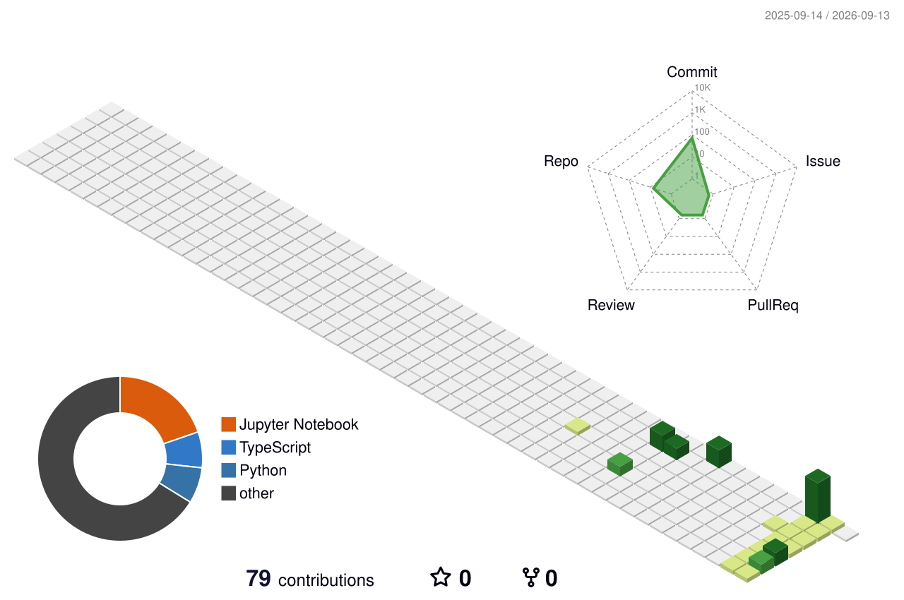

<div align="center">


[](https://git.io/typing-svg)

<br/>


<br/><br/>

[](https://linkedin.com/in/krishnasingh13)
[](https://instagram.com/_yk.krishna)
[](mailto:itsmekrishna1307@gmail.com)
[](https://github.com/itsmekrishna13-code)

<br/>


</div>

---

## 🧊 3D Contribution Graph

<div align="center">
  
</div>

---

## About

I am a **B.Sc. Data Science student at B.K. Birla College, Kalyan**, focused on building **AI-powered projects and real-world data science applications**. I don't wait for assignments to start building — while others are still figuring out Python, I'm already shipping projects on GitHub and at hackathons.

My work spans the complete data science lifecycle — from **data exploration, cleaning, feature engineering, and EDA** to **machine learning, predictive modeling, and visualization**, all with a product-minded approach.

### Open To

* Machine Learning & Data Science Internships
* Data Analysis Opportunities
* Hackathons & Innovation Challenges
* Open Source Contributions
* AI & ML Project Collaborations

---

## 🛠️ Tech Stack

### Programming Languages

<p align="center">
  
</p>

### AI, Machine Learning & Data Science

<p align="center">


</p>

### Backend & Databases

<p align="center">
  
</p>

### Software Engineering & Tooling

<p align="center">
  
</p>

---

## 🤖 AI / ML Expertise

| Area                     | Level        | Details                                                          |
| :----------------------- | :----------: | :--------------------------------------------------------------- |
| **Data Science**         | Developing   | EDA, data cleaning, feature engineering, visualization           |
| **Machine Learning**     | Developing   | Regression, classification, model evaluation, predictive modeling |
| **Python Programming**   | Proficient   | Libraries like Pandas, NumPy, Matplotlib, Scikit-Learn            |
| **Data Analysis**        | Proficient   | Structured thinking, insight generation, storytelling with data   |

---

## 🚀 Featured Projects

<details>
<summary><b>Vecna AI — Voice-Powered AI Desktop Assistant</b></summary>

<br/>

A Jarvis-style AI desktop assistant built for the college event TechXpression — combining voice, PC control, web search, and weather.

| Metric       | Details                                              |
| :----------- | :--------------------------------------------------- |
| **Stack**    | Python · Voice Processing · Automation               |
| **Features** | Voice + PC Control + Web Search + Weather            |
| **Impact**   | Real-world AI product built for a live college event |
| **Repository** | [View Repository](https://github.com/itsmekrishna13-code/vecna-ai) |

</details>

<br/>

<details>
<summary><b>CineScore AI — Movie Rating & Sentiment Analysis</b></summary>

<br/>

EDA and ML analysis on Netflix Movies & TV Shows dataset — understanding ratings and user sentiment with Python.

| Metric       | Details                                            |
| :----------- | :------------------------------------------------- |
| **Stack**    | Pandas · NumPy · Matplotlib · Scikit-Learn         |
| **Focus**    | EDA, data visualization, ML analysis               |
| **Impact**   | Extracts meaningful insights from entertainment data |
| **Repository** | [View Repository](https://github.com/itsmekrishna13-code/netflix-rating-analysis) |

</details>

<br/>

<details>
<summary><b>Churn Predictor — Customer Churn Prediction</b></summary>

<br/>

Customer churn prediction using Random Forest on a Telco dataset — achieving ~80% accuracy with Logistic Regression comparison.

| Metric         | Details                                       |
| :------------- | :-------------------------------------------- |
| **Stack**      | Scikit-Learn · Pandas · ML Modeling           |
| **Performance**| ~80% accuracy (Logistic Regression)           |
| **Impact**     | Business value via churn prediction           |
| **Repository** | [View Repository](https://github.com/itsmekrishna13-code/customer-churn-prediction) |

</details>

<br/>

<details>
<summary><b>DataForge AI — Coming Soon</b></summary>

<br/>

An upcoming AI-powered data engineering / analysis tool. Stay tuned.

| Metric       | Details                                           |
| :----------- | :------------------------------------------------ |
| **Stack**    | Python · AI · Data Processing                     |
| **Status**   | Coming Soon                                       |

</details>

---

## 🏆 Hackathon & Community Experience

### Developer · Builder

**TechXpression · BK Birla College**

Built and demonstrated the Vecna AI assistant at the college event, showcasing voice + PC control + AI integration to a live audience.

`AI` `Voice Processing` `Python` `Live Demo`

<br/>

### Data Science Intern

**ShadowFox (July 2026)**

Hands-on data science internship building real-world analysis and ML skills.

`Data Science` `Python` `Analysis` `ML`

---

## 📜 Certifications


---

## 📊 GitHub Analytics

<div align="center">


<br/>


</div>

---

## 📈 Contribution Activity

<div align="center">

[](https://github.com/itsmekrishna13-code)

</div>

---

## 🌱 Current Focus

```yaml
learning:
  - Machine Learning
  - Data Science
  - Python for Data Analysis
  - AI & Deep Learning concepts

building:
  - AI-powered projects
  - Real-world data science applications
  - Expanding my GitHub portfolio

exploring:
  - Data Visualization
  - Predictive Modeling
  - Open Source
  - Hackathon projects

open_to:
  - ML and Data Science Internships
  - Data Analysis Opportunities
  - Hackathons and Collaborations
```

---

<div align="center">

### *Data nerd who ships. Turning curiosity and caffeine into AI projects.* ☕


</div>

<!-- Proudly created with GPRM ( https://gprm.itsvg.in ) + github-profile-3d-contrib -->
